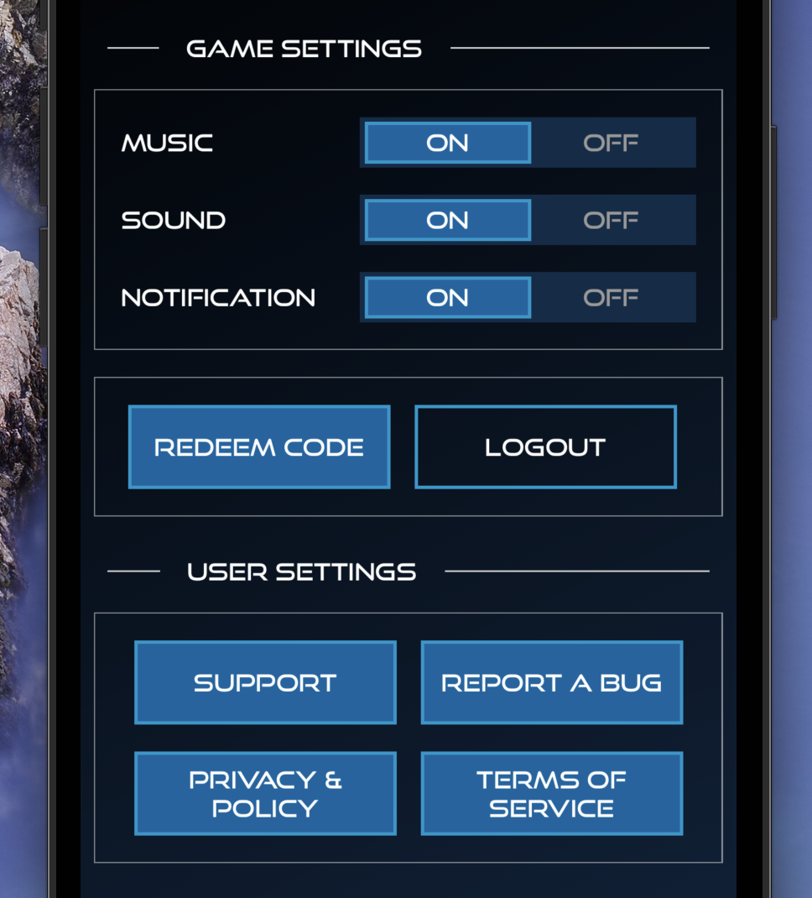
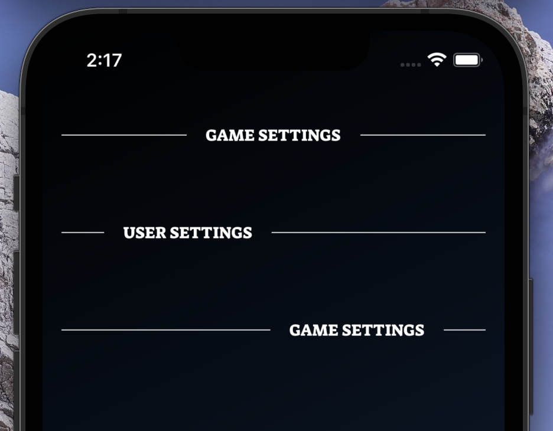

[](https://github.com/WrathChaos/react-native-flex-divider)

[](https://www.npmjs.com/package/react-native-flex-divider)
[](https://www.npmjs.com/package/react-native-flex-divider)

[](https://opensource.org/licenses/MIT)
[](https://github.com/prettier/prettier)

<table>
  <tr>
    <td align="center">
      
    </td>
    <td align="center">
      
    </td>
   </tr>
  
</table>

# Installation

Add the dependency:

```bash
npm i react-native-flex-divider
```

## Peer Dependencies

Zero Dependency

# Usage

## Import

```jsx
import FlexDivider from "react-native-flex-divider";
```

## Fundamental Usage

```jsx
<FlexDivider text="Settings" />
```

## Customization Usage

```jsx
<FlexDivider
  text="USER SETTINGS"
  textStyle={{ fontFamily: "SuezOne-Regular" }}
  rightDividerStyle={{ flex: 5 }}
/>
```

## Example Project 😍

You can checkout the example project 🥰

Simply run

- `npm i`
- `react-native run-ios/android`

should work of the example project.

# Configuration - Props

## Fundamentals

| Property |  Type  |  Default  | Description     |
| -------- | :----: | :-------: | --------------- |
| text     | string | undefined | change the text |

## Customization (Optionals)

| Property          |   Type    | Default | Description                                                             |
| ----------------- | :-------: | :-----: | ----------------------------------------------------------------------- |
| style             | ViewStyle | default | set or override the style object for the main container                 |
| text              | ViewStyle | default | set or override the style object for the `text style`                   |
| leftDividerStyle  | ViewStyle | default | set or override the style object for the `left divider style`           |
| rightDividerStyle | ViewStyle | default | set or override the style object for the `right divider style`          |
| TextComponent     |   Text    | default | set your own component instead of default react-native `Text` component |

## Future Plans

- [x] ~~LICENSE~~
- [ ] Write an article about the lib on Medium

## Author

FreakyCoder, kurayogun@gmail.com

## License

React Native Flex Divider is available under the MIT license. See the LICENSE file for more info.
